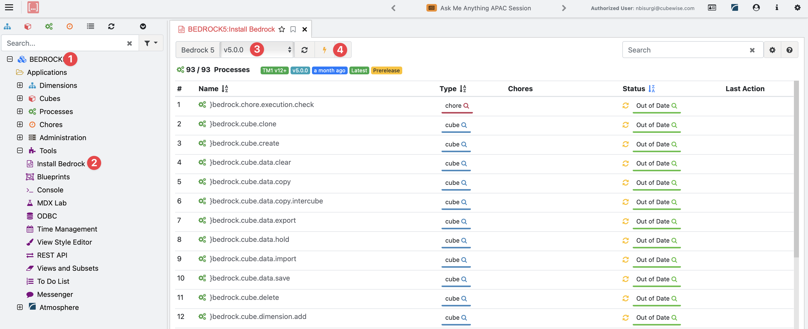

# Bedrock 5 Installation Guide

This folder contains all necessary files and documentation for installing Bedrock 5, a comprehensive library of TurboIntegrator (TI) processes for IBM Planning Analytics / TM1.

## Before You Install

### ⚠️ Important Warnings

1. **Backup First**: Always backup your existing processes before installation
2. **Customizations**: If you've modified existing Bedrock processes, use the [upgrade procedure](manual_upgrade.md) to preserve changes
3. **Permissions**: Ensure you have appropriate administrative access to your TM1 instance
4. **API Key**: For PAW installation, you'll need to [generate an API key](https://github.com/cubewise-code/bedrock-5/wiki/Generate-an-API-Key-Guide)

---

## Quick Start: Choose Your Installation Method

| Method | Best For | Complexity | Customization |
|--------|----------|------------|---------------|
| **[Arc Installation](#1-arc-installation-recommended-for-arc-users)** | Cubewise Arc users | Easy | None |
| **[Script Installation](#2-script-installation-automated-setup)** | Python or Windows users wanting automated setup with compare capabilities| Easy | Full |
| **[PAW Installation](#3-paw-installation-full-control)** | Users needing full control or customizations | Medium | Full |

---

## Installation Methods

### 1. Arc Installation (Recommended for Arc Users)
**Prerequisites:** Cubewise Arc installed and connected to your TM1 instance

**Quick Steps:**
1. Connect to your V12 instance using Arc
2. Navigate to **Tools → Install Bedrock**
3. Select the Bedrock version from the toolbox
4. Click the Install icon



---

### 2. Script Installation (Automated Setup)

#### Option A: Windows Executable (Recommended)
**Prerequisites:** Windows machine with network access to your TM1 server

**Quick Steps:**
1. Download the latest release package from [releases](https://github.com/cubewise-code/bedrock-5/releases)
2. Extract the package
3. Double-click `bedrock_installer.exe`
4. Follow the on-screen prompts to configure your TM1 connection and installation

#### Option B: Python Script
**Prerequisites:**
- Python 3.9 or higher
- pip (Python package manager)
- Network access to your TM1 server

**Installation Steps:**
1. Extract the release package
2. Open a command prompt in the extracted folder
3. Install dependencies:
   ```bash
   pip install --force-reinstall --upgrade -r requirements.txt
   ```
4. Run the installer:
   ```bash
   python bedrock_installer.py
   ```

**Configuration:**
- First run creates a `config.ini` file from the sample
- Edit `config.ini` with your TM1 server details
- Run the installer again to deploy Bedrock

**Features:**
- Automatic configuration file generation
- Built-in comparison tool for upgrades
- Support for multiple TM1 authentication methods 

---

### 3. PAW Installation (Full Control)
**Prerequisites:** Access to IBM Planning Analytics Workspace (PAW), API key for authentication

#### For New Installations
Follow the detailed step-by-step guide: [Manual Installation Guide](manual_installation.md)

**Overview:**
1. Download `installation_files/assets/bedrock.json` file
2. Upload to TM1 Database File Manager
3. Create and run the installation TurboIntegrator process
4. Configure with your API key and connection details

#### For Upgrades
If you have modified Bedrock processes, use: [Manual Upgrade Guide](manual_upgrade.md)

**Overview:**
1. Use `bedrock-v11.json` for comparison
2. Identify modified processes
3. Selectively update processes
4. Preserve customizations

---


### Getting Help
- **Documentation**: [Bedrock Wiki](https://github.com/cubewise-code/bedrock-5/wiki)
- **Issues**: [GitHub Issues](https://github.com/cubewise-code/bedrock-5/issues)
- **Community**: [Cubewise Community Forum](https://community.cubewise.com)

---

## License and Support

Bedrock is open-source and provided under the MIT License. For commercial support options, contact [Cubewise](https://www.cubewise.com).

Last updated: September 2025