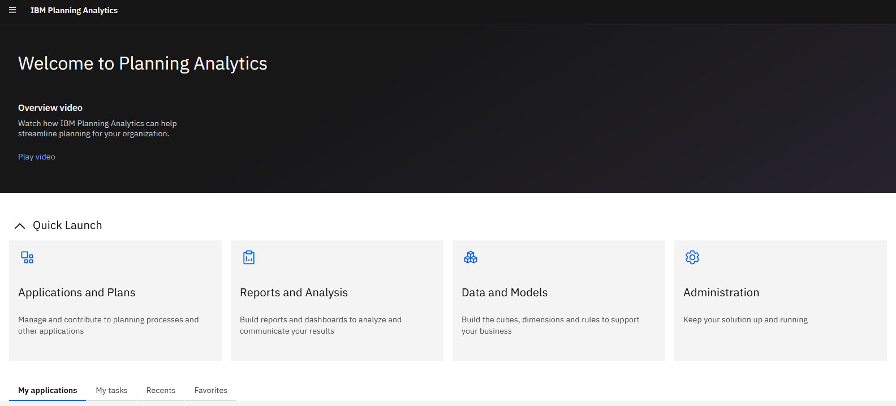
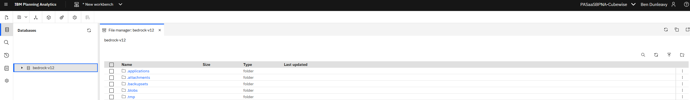

> [!CAUTION]
> :bangbang: If Bedrock processes have been modified, this installation guide will overwrite those changes. Please see the [Upgrade Guide](https://github.com/cubewise-code/bedrock-5/wiki/Upgrade-Guide) instead. :bangbang:

## Step 1
In this repository, navigate to the folder [`installation_files`](https://github.com/cubewise-code/bedrock-5/tree/main/installation_files).

## Step 2
Download a copy of the file `installation_files/assets/bedrock.json`.

## Step 3
Go to your IBM Planning Analytics Database File Manager. To open your IBM Planning Analytics Database File Manager, complete the following steps:

- Navigate to your IBM Planning Analytics environment at:  
  `https://<region>.planninganalytics.saas.ibm.com`. Replace `<region>` with your region.  

  

- Click the hamburger menu icon.  

  

- Click "+ New".  

  

- Click "Workbench".  

  

- Right-click the name of the database where you want to install Bedrock.  

  

- Click "File Manager".  

  

---

## Step 5
Create a new TurboIntegrator Process. You can name it anything; it can be deleted after installation.

## Step 6
Go back to the folder [`installation_files`](https://github.com/cubewise-code/bedrock-5/tree/main/installation_files).

## Step 7
Copy the text in the file `bedrock_installation_ti.txt` and paste it into the prologue of the TurboIntegrator process you just created.

## Step 8
In line 7, replace `<api_key_value>` with your API Key. [To generate an API Key, follow the steps in this guide](https://github.com/cubewise-code/bedrock-5/wiki/Generate-an-API-Key-Guide).

## Step 9
In line 8, replace `<tenant_id>` with your instance's Tenant ID. Your Tenant ID can be found in the TM1 URL, after `tenantId=` and before `&`, as shown below:

## Step 10
In line 8, replace `<database_name>` with your TM1 Database's Name. The TM1 Database Name can be seen here:

:bangbang: Make sure your IBM Planning Analytics Database Name is URL encoded. To URL encode your Database Name, paste it in the text box at this website: [URL Encoder](https://www.urlencoder.org/) :bangbang:

---

## Step 11
Save and run the process.

## Step 12
When the process is complete, Bedrock will be installed!

## Step 13
Delete `}bedrock-installation.process` from the TM1 Database.

## Step 14 (Optional)
Delete `bedrock.json` and the process you created.

